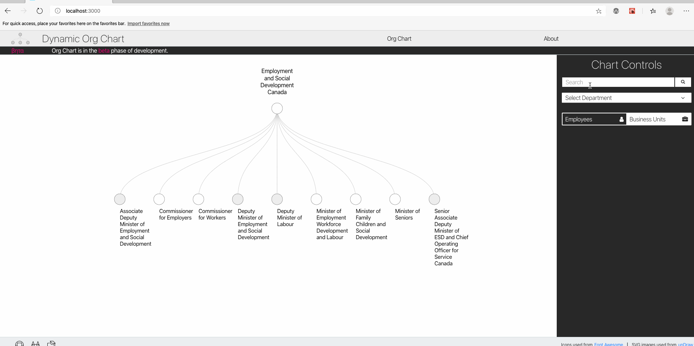
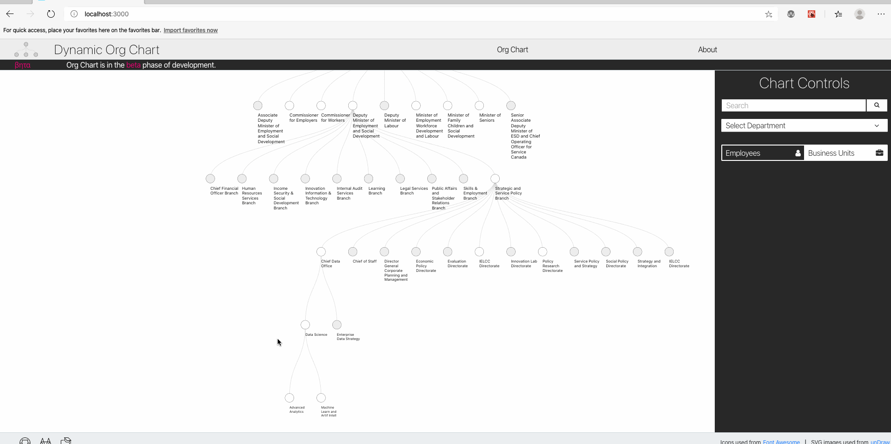
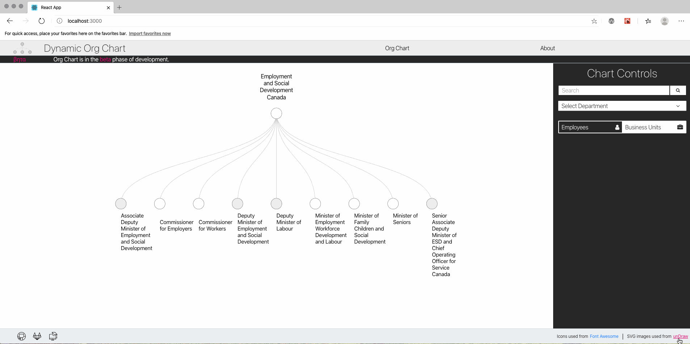

# React-d3 Integration
> This repository illustrates one way to integrate D3.js with React. The use case for this integration is an interactive searchable organization chart for the Government of Canada. The underlying organization chart data are derived using the [Government of Canada Employee Contact Information (GEDS)](https://open.canada.ca/data/en/dataset/8ec4a9df-b76b-4a67-8f93-cdbc2e040098) dataset that is made available under the [Open Government License - Canada](https://open.canada.ca/en/open-government-licence-canada). The code that was used to extract the org chart from the GEDS dataset can be found [here](https://github.com/Collinbrown95/goc-org-chart/blob/master/back-end/utils.py).

## Overview and Features
D3.js is one of the most commonly used JavaScript libraries for building interactive data visualizations on the web. Similarly, React and the ecosystem of libraries built around React have become one of the most popular choices for building component based user interfaces.

The use case of an interactive organization chart was chosen because it includes features that require interactions with React components to cause updates to the D3 visualization. Similarly, it requires that DOM elements controlled by D3 pass data to React so that React can update the application state and render/update components in response to the D3 interaction.

The features are listed below.

__Core features__
1. When a user clicks a node in the tree chart, D3 should handle how DOM elements are transitioned/animated, and then allow React to update this data in its state.


2. When a user selects a dataset from the dropdown menu, React should fetch the data for this tree, and pass it to d3 to render on the DOM.


1. When a user clicks on a search result, the tree chart should open to the node that contains what the user searched for (e.g. a business unit or person).



4. When a user clicks the "See the team" tooltip, the chart controls component should display the members who are on that team.



__Nice (but not essential) features__
1. When a user resizes their browser, the d3 visualization should resize to fit the user's screen.



2. The usual pan-and-zoom functionality that can be implemented with D3 should not be affected by this integration with React.


Note that several of these features above use fake data (e.g. fake search results, fake team list, etc). Since the focus of this repo is on integrating react and d3, using placeholder data is sufficient for illustrative purposes.

## High Level Overview
The approach used in this project is to allocate a react component that renders an empty SVG that D3 will treat as the root element. Inside this SVG, D3 has full DOM control, and application-level data are passed from React to D3 through props to the component that renders the SVG.

### React refs
The TreeChartD3 component makes use of [React refs](https://reactjs.org/docs/refs-and-the-dom.html) to hold direct references to the empty SVG as well as the div element that contains it. Using these refs, it is possible to execute d3 code imperatively inside of the TreeChartD3 component. This allows the d3 code to directly modify DOM elements inside of the svg ref outside of React's typical data flow.

Intuitively, this means that the svg ref is the "hand-off" point where React lets d3 take control of the DOM. Unlike ordinary React components that are updating the virtual DOM and 

## D3 and React - general information
- General update pattern of d3 is to select elements, map and synchronize those elements to data, and define handlers for what should happen to the svgs when data are entered, updated, or exited.

## ResizeObserver

## D3 tree utilities
```
data = {
    "name": "Level 1",
    "children": [
        {
            "name": "Level 2 A",
            "children": [
                ...
            ]
        },
        {
            "name": "Level 2 B",
            "children": [
                ...
            ]
        },
        ...
    ]
}
```

- Given hierarchical data formatted as above, ```const root = hierarchy(data);``` maps the JSON to a tree data structure with many properties of the tree (e.g. descendents, height, depth, links between nodes, etc.)
- after calling ```hierarchy(data)```, we get ```root.descendents()``` which is a flat array containing all nodes of the tree, including the root. This is what D3 uses to draw the nodes of the tree.

- When we call ```root.links()```, it creates an array of all the links (edges) between nodes in the tree.

- ```const treeLayout = tree().size([height, width]); treeLayout(root)``` Given a height and width (see notes on resize observer above), enriches the nodes of roots with x and y coordinates that are calculated based on the width and height of ```treeLayout```.

- When nodes enter, they are given the class ```node```.

- ```d``` attribute for links is handled by the ```linkGenerator``` to draw the links between nodes
  

## Update Pattern - Important Notes
- D3 works by aligning data elements to DOM elements; this is done by performing a selection over DOM elements and calling ```.data(data, identityMappingCallback)``` on that selection to map each data point to a DOM element. The second argument is a callback function that provides an identity that maps each DOM element to its corresponding data point.
- By default, the identity mapping is just the index of the data structure (e.g. a JavaScript array would just use indices 0,1,2, etc. to correspond to the first, second, third, etc. DOM elements). If the data change, however (e.g. in an interactive visualization), this mapping would no longer be correct as elements entering/exiting the selection will not be assigned to their original identity.
- This is further complicated by the fact that we are "linking" d3 into the application by using a ```useRef()``` hook to provide a reference to the ```<svg>``` tag that d3 selects to append/remove elements from the DOM, and also a ```useEffect()``` hook to update the d3 component of the application whenever a change is detected from an outside react component that should affect the d3 visualization. For example, if the browser window resizes or some data is passed in from a parent/global state, then the code used to apply those modifications is implemented inside the ```useEffect()``` hook. ```useEffect()``` runs whenever it detects a change in one of the state variables inside the hook's dependancy array.
-  Below is the implementation of ```identityMappingCallback``` used in this project:
```JavaScript
identityMappingCallback = (d) => {
    if (d.id) {
        return d.id;
        } else {
        setIdentity(identity+1)
        return (d.id = ++identity)
        }
    }
```
- It is assumed there exists some int variable called ```identity``` that exists in a higher scope. One way to implement this correctly is to set this global variable as a state in a parent component, and pass the relevant setState function to the Tree Chart component. This way, when ```useEffect()``` fires again, it will not reset any variables declared in the scope of the ```TreeChart``` functional component.
  - If ```identity``` is set inside the scope of ```TreeChart```, any calls to ```useEffect()``` will reset the identity, which renders the mapping between data and DOM elements prior to the call to ```useEffect()``` incorrect.


__Sources__

1. This [YouTube playlist](https://www.youtube.com/watch?v=Y-ThTzB-Zjk&list=PLDZ4p-ENjbiPo4WH7KdHjh_EMI7Ic8b2B&index=20)
2. [D3 zoom - the missing manual](https://www.freecodecamp.org/news/get-ready-to-zoom-and-pan-like-a-pro-after-reading-this-in-depth-tutorial-5d963b0a153e/)
3. https://www.d3indepth.com/enterexit/
4. https://coderwall.com/p/psogia/simplest-way-to-add-zoom-pan-on-d3-js
5. https://medium.com/@jeffbutsch/using-d3-in-react-with-hooks-4a6c61f1d102
6. [React effect hooks documentation](https://reactjs.org/docs/hooks-effect.html) and [post on multiple effect hooks](https://stackoverflow.com/questions/54002792/should-i-use-one-or-many-useeffect-in-component) https://reactjs.org/docs/hooks-rules.html
7. https://stackoverflow.com/questions/47392549/how-to-update-data-in-d3-version-4 <-- change in update pattern from v3 to v4
8. https://bost.ocks.org/mike/transition/ transitions documentation, https://bost.ocks.org/mike/selection/ selection documentation
9. https://www.tutorialspoint.com/d3js/d3js_svg_transformation.htm d3 tutorial on svg transformations
10. https://stackoverflow.com/questions/53253940/make-react-useeffect-hook-not-run-on-initial-render/53254028#53254028 toggling useEffect hook on initial render vs. subsequent renders, https://stackoverflow.com/questions/53253940/make-react-useeffect-hook-not-run-on-initial-render also related
11. https://www.d3indepth.com/enterexit/ enter update exit pattern in d3
12. https://bost.ocks.org/mike/selection/ how selection works
13. [D3 tree with weighted links and color coding](http://bl.ocks.org/shubhgo/80323b7f3881f874c02f)
14. [collapse function to hide children](https://stackoverflow.com/questions/45326393/how-to-show-only-specific-node-level-in-d3-tree-layout)
15. [centering with nodeSize vs. size](https://stackoverflow.com/questions/44013555/centering-of-d3-tree-changes-when-specifying-nodesize)
16. [.separation(callback(a,b)) to deal with spacing nodes that aren't immediate siblings](https://stackoverflow.com/questions/42524376/tree-nodesize-in-d3-v4)
17. [add tooltip](https://stackoverflow.com/questions/49611148/how-to-add-tooltip-in-react-d3-v4-bar-chart)
18. [react-d3 tooltip (TODO: see if there is a straightforward way to get the rendered tooltip by its ID then use d3 to handle transitions, delays, etc.)](https://github.com/react-d3/react-d3-tooltip) (see here also https://www.npmjs.com/package/react-d3-tooltip). Other approach could be to add/remove classes and handle transition animations with css (see [here](https://stackoverflow.com/questions/38116805/react-js-d3-charts-tooltip/56674517#56674517)).
19. [custom dropdown menu tutorial](https://blog.logrocket.com/building-a-custom-dropdown-menu-component-for-react-e94f02ced4a1/) with [github page](https://github.com/dbilgili/Custom-ReactJS-Dropdown-Components).
20. [D3-react tutorial](https://medium.com/@Elijah_Meeks/interactive-applications-with-react-d3-f76f7b3ebc71)

__React Hooks and Context API__
1. [this tutorial](https://blog.logrocket.com/use-hooks-and-context-not-react-and-redux/)
2. [this youtube playlist](https://www.youtube.com/watch?v=6RhOzQciVwI&list=PL4cUxeGkcC9hNokByJilPg5g9m2APUePI&index=1)
3. [detailed explanation of useEffect and order of updating/rendering](https://overreacted.io/a-complete-guide-to-useeffect/)